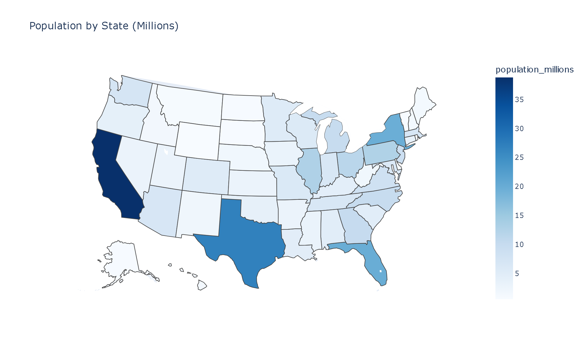
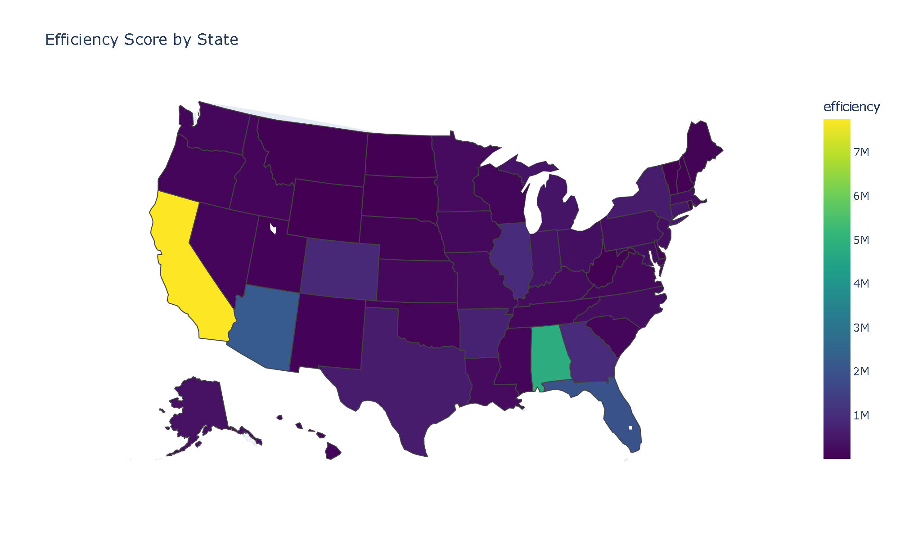
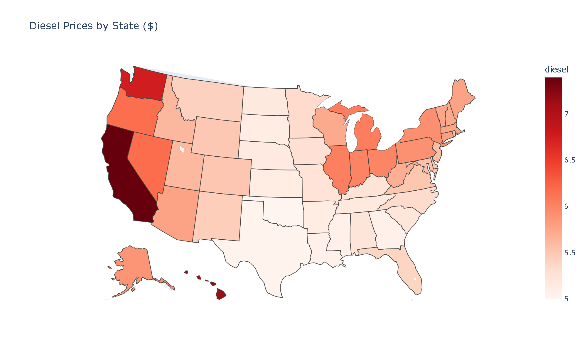
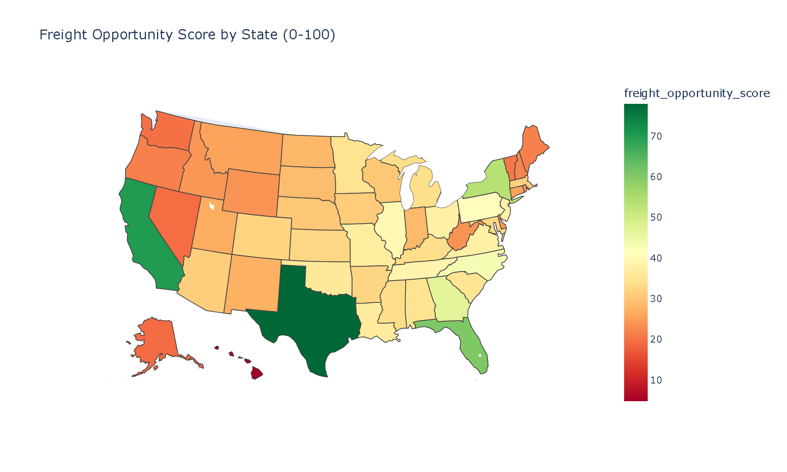
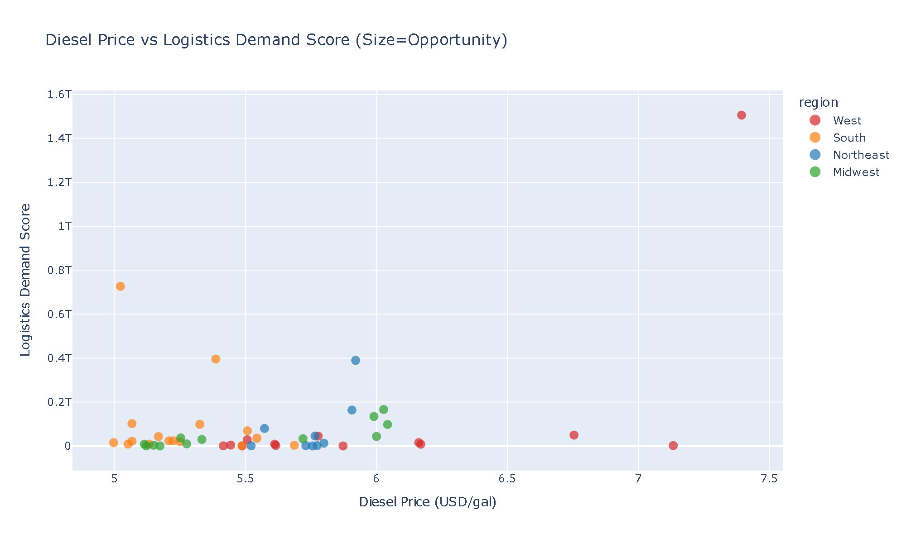
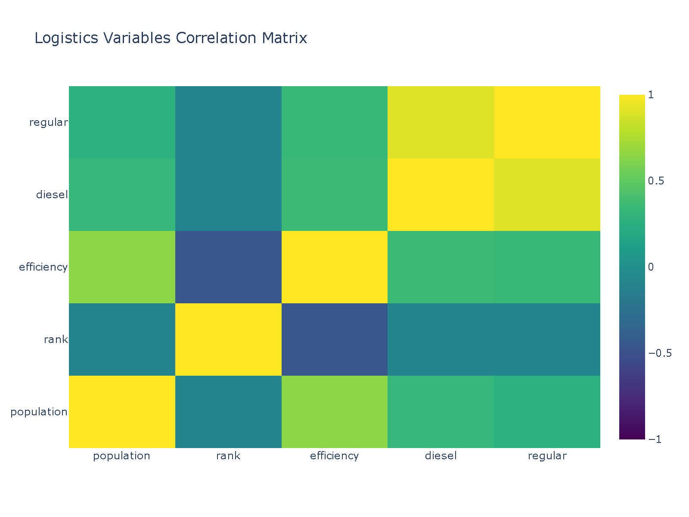

# 🚢 DashLogistics — Logistics Intelligence Pipeline

[](https://github.com/juandelaf1/DashLogistics/actions)
[](https://python.org)
[](tests/)
[](https://streamlit.io)
[](https://pandas.pydata.org)
[](LICENSE)

> ETL pipeline end-to-end que transforma datos públicos de logística en inteligencia de negocio: demografía, combustibles y clima enriquecidos con KPIs, mapas interactivos y un dashboard funcional.

---

## Dashboard

| Población | Eficiencia | Combustible |
|:---:|:---:|:---:|
|  |  |  |
| **Oportunidad logística** | **Demanda vs Coste** | **Correlaciones** |
|  |  |  |

---

## Stack

| Capa | Tecnología |
|------|-----------|
| Lenguaje | Python 3.13 |
| Datos | Pandas 3.x + SQLAlchemy + SQLite/PostgreSQL |
| Scraping | Requests + BeautifulSoup |
| Validación | Pydantic v2 |
| Dashboard | Streamlit + Plotly |
| Tests | pytest (17 tests) |
| CI/CD | GitHub Actions |

---

## Inicio rápido

```bash
git clone https://github.com/juandelaf1/DashLogistics.git
cd DashLogistics
pip install -r requirements.txt
python main.py                    # Pipeline completo
streamlit run dashboard/dashboard.py  # Dashboard
```

**No necesitas PostgreSQL** — el pipeline funciona con SQLite por defecto. Si tienes PostgreSQL, configure `DATABASE_URL` en `.env`.

---

## Pipeline

```
shipping_data.csv (52 estados)
       │
       ▼
  ETL ──► clean + validate (Pydantic) ──► shipping_stats (SQLite/PG)
       │
       ▼
  AAA fuel scraper ──► fuel_prices (50 estados, precio real)
       │
       ▼
  OpenWeatherMap ──► weather_data (temperatura, humedad, viento)
       │
       ▼
  Enriched dataset ──► data/final/enriched_data.csv (50 filas × 15 cols)
       │
       ▼
  KPIs + Features ──► freight_opportunity_score, efficiency_tiers, regiones
```

### Ejecución

```bash
python main.py
```

Salida:
```
▶ Step 1: Downloading raw data...
▶ Step 2: Running ETL (clean & validate)...   50 estados válidos
▶ Step 3: Scraping fuel prices...             50 precios AAA
▶ Step 4: Enriching with weather data...      50 registros OpenWeatherMap
▶ Step 5: Creating final enriched dataset...  50 filas × 15 columnas
✅ PIPELINE COMPLETED SUCCESSFULLY
```

---

## Tests

```bash
pytest -v    # 17/17 passing
```

Incluye tests de: ETL (limpieza, validación), scrapers (fuel), KPIs (básicos, eficiencia, composite), feature engineering, logging (RunIdFormatter/Filter), integración (pipeline completo), y manejo de edge cases (DataFrames vacíos).

---

## Estructura

```
src/
├── etl/              # Pipeline: etl.py, scrapers/, enrichment/
│   ├── enrichment/   # weather_api.py (OpenWeatherMap)
│   └── scrapers/     # fuel_scraper.py (AAA gas prices)
├── database/         # db.py (SQLite fallback + helpers pandas 3.x)
├── analysis/         # kpis.py (15 métricas), features.py
├── utils/            # state_mapper.py, download_data.py
└── visualization/    # charts.py
dashboard/            # dashboard.py (Streamlit)
tests/                # 17 tests
data/                 # raw/ → clean/ → final/
```

---

## KPIs generados (15 métricas)

| Grupo | Métricas |
|-------|----------|
| Básicos | total_states, total_population, avg_population, max_population, min_population, population_std, top_state, bottom_state |
| Eficiencia | avg_efficiency_score, efficiency_score (por estado), efficiency_percentile, efficiency_tier |
| Combustible | fuel_cost_index, avg_diesel, avg_regular |
| Avanzados | freight_opportunity_score, logistics_demand_score, cost_efficiency_index |

---

## Datos

- **Población**: US Census 2014 (Plotly dataset, 52 estados)
- **Combustible**: AAA Gas Prices (scraping en tiempo real, 50 estados)
- **Clima**: OpenWeatherMap (50 estados, 30s de ejecución)
- **Salida**: CSV en `data/final/` + BD SQLite (`dashlogistics.db`)

---

## Roadmap

- [x] ETL pipeline funcional (sin depender de PostgreSQL)
- [x] Dashboard interactivo con mapas + KPIs
- [x] Fuel scraper resiliente (User-Agent real, graceful degradation)
- [x] Weather enrichment (OpenWeatherMap, funcional)
- [x] 17 tests pasando, CI verde
- [ ] Histórico temporal de precios de combustible
- [ ] Modelo predictivo de eficiencia logística
- [ ] Despliegue cloud (Streamlit Cloud)
- [ ] Integración con SkyCast (módulo climático)

---

## Autor

**Juan de la Fuente** — [@juandelaf1](https://github.com/juandelaf1) — [LinkedIn](https://linkedin.com/in/juandelafuentelarrocca)

<p align="center">🚢 <b>DashLogistics</b> — datos logísticos, decisiones reales</p>
