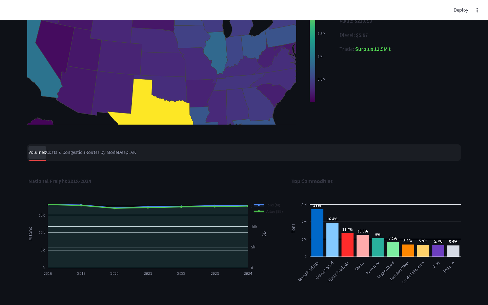
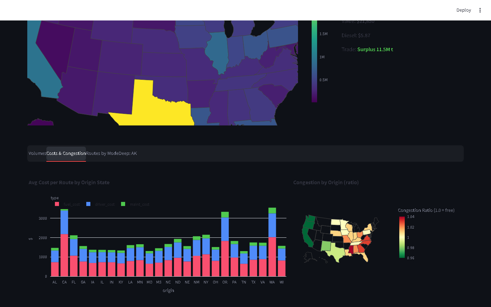
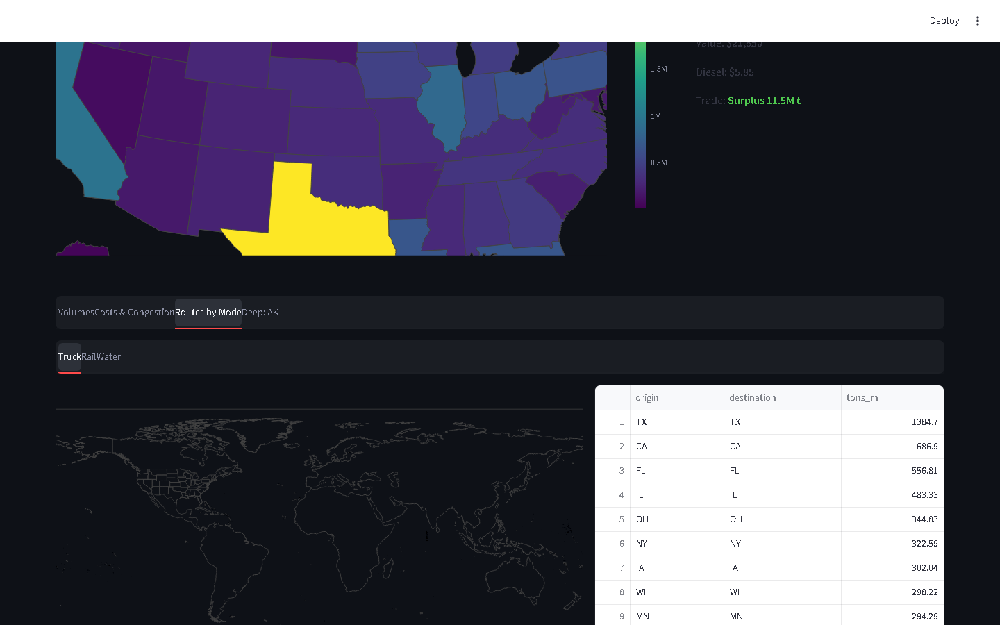
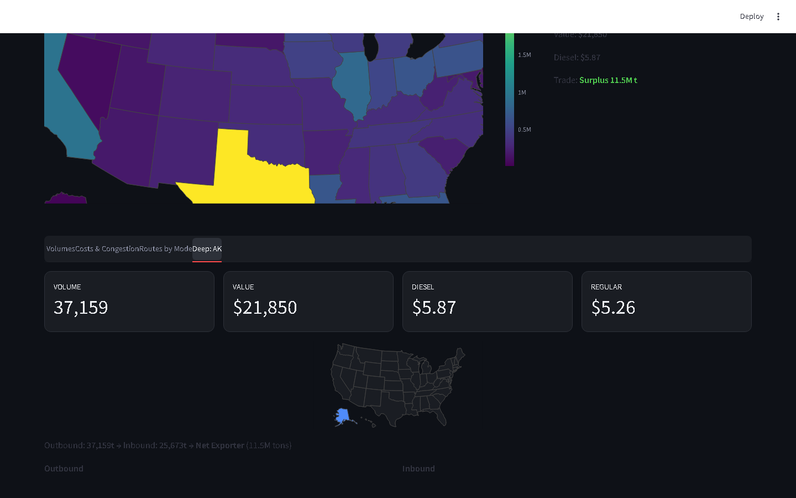

# DashLogistics — Logistics Intelligence Pipeline

[](https://github.com/juandelaf1/DashLogistics/actions)
[](https://python.org)
[](tests/)
[](https://streamlit.io)
[](https://docker.com)
[](LICENSE)

> **From public data to logistics intelligence.**  
> An end-to-end data pipeline that ingests, models, and visualizes real US freight data — demonstrating an architecture designed for portability to any region (EU, LATAM, APAC).

---

## Dashboard


| Tab | Preview |
|-----|---------|
| **Volumes** — trends, commodities, mode split, trade balance |  |
| **Costs & Congestion** — operating cost, congestion heatmap, efficient lanes |  |
| **Routes by Mode** — Truck / Rail / Water flow maps |  |
| **Deep Dive** — state-level drill-down with all metrics |  |

---

## What This Project Demonstrates

This is not a shipping product — it's a **portfolio of data engineering & analytics skills** built with real logistics data:

| Skill | Implementation |
|-------|---------------|
| **ETL Pipeline Design** | Multi-stage ingestion from 5+ public sources (CSV, REST APIs, web scraping) |
| **Data Modeling** | Aggregation, derived features, trade balance, congestion proxy |
| **Cost Analytics** | Operating cost engine: fuel + driver + maintenance per route |
| **Geospatial Analysis** | OSRM routing, state-to-state distance caching, flow visualization |
| **Dashboard Engineering** | Streamlit + Plotly with interactive mapping and multi-tab UX |
| **Infrastructure** | Docker containerization, multi-stage builds, GitHub Actions CI |
| **Resilience** | SQLite fallback, graceful degradation on API failures, retry logic |

The architecture is designed to be **adapted to local data sources** in any market — Eurostat (EU), INE (LATAM), or municipal transit authorities — making this a template for logistics intelligence worldwide.

---

## Pipeline Architecture

```
┌─────────────────────────────────────────────────────────────────────────────┐
│                           DATA INGESTION LAYER                              │
├─────────────────────────────────────────────────────────────────────────────┤
│                                                                             │
│  BTS FAF 5.7.1 ────► CSV (86MB) ──► FAF Loader ──► 10 relational tables    │
│  USDA Ag Transport ─► SODA API ────► USDA Client ──► truck_rates (263 rec)  │
│  OSRM ──────────────► Public API ─► OSRM Router ──► state_routes (625)      │
│  EIA ───────────────► REST API ───► EIA Fetcher ───► eia_fuel_prices        │
│  AAA ───────────────► Scraper ─────► Fuel Parser ──► fuel_prices (50 states)│
│                                                                             │
└─────────────────────────────────────────────────────────────────────────────┘
                                    │
                                    ▼
┌─────────────────────────────────────────────────────────────────────────────┐
│                           FEATURE ENGINEERING                               │
├─────────────────────────────────────────────────────────────────────────────┤
│                                                                             │
│  Operating Cost = fuel_cost + driver_cost + maint_cost per mile             │
│  Fuel Cost     = miles / 6.5mpg × diesel_price                              │
│  Driver Cost   = hours × $35/hr                                             │
│  Maintenance   = miles × $0.15/mi                                           │
│  Congestion    = actual_time / freeflow_time (55mph)                        │
│  Lane Efficiency = tons_per_dollar                                          │
│  Trade Balance = outbound - inbound tons per state                          │
│                                                                             │
└─────────────────────────────────────────────────────────────────────────────┘
                                    │
                                    ▼
┌─────────────────────────────────────────────────────────────────────────────┐
│                           VISUALIZATION LAYER                               │
├─────────────────────────────────────────────────────────────────────────────┤
│                                                                             │
│  Streamlit Dashboard ──── 4 tabs ──── Interactive choropleth map            │
│  Port 8502                 Flow lines          Select-state drill-down      │
│                            KPI cards           USDA rate comparison         │
│                            Mode split          Cost breakdown               │
│                            Trade balance       Congestion analysis          │
│                                                                             │
└─────────────────────────────────────────────────────────────────────────────┘
```

---

## Data Sources

| Source | Data | Access | Refresh |
|--------|------|--------|---------|
| [BTS FAF 5.7.1](https://www.bts.gov/faf) | State-to-state freight flows (tons, value, mode, commodity, 2018-2024) | Public CSV (86MB) | Semi-annual |
| [USDA Ag Transport](https://agtransport.usda.gov/) | Refrigerated truck rates per mile by lane | SODA API (free) | Quarterly |
| [OSRM](https://project-osrm.org/) | Driving distance & time between state centroids | Public routing API | On-demand |
| [EIA](https://www.eia.gov/opendata/) | Official weekly diesel & gasoline prices | REST API (free key) | Weekly |
| [AAA Gas Prices](https://gasprices.aaa.com/) | Street-level fuel prices by state | Web scraping | Daily |

**No API keys required for basic operation** — FAF, USDA, and OSRM are all public. EIA and weather keys are optional.

---

## Quick Start

### Docker (recommended)

```bash
docker compose up -d
# Open http://localhost:8502
# Pipeline runs automatically on first start
```

### Local

```bash
pip install -r requirements.txt
python main.py                          # Run full pipeline
streamlit run dashboard/dashboard.py    # Launch dashboard
```

---

## Project Structure

```
├── main.py                     # Pipeline orchestrator (8 steps)
├── Dockerfile                  # Self-contained container
├── docker-compose.yml          # One-command startup
├── requirements.txt
│
├── src/
│   ├── etl/enrichment/         # Data ingestion modules
│   │   ├── faf_loader.py       # FAF 5.7.1 → SQL tables
│   │   ├── usda_rates.py       # USDA API client
│   │   ├── osrm_routing.py     # OSRM with SQLite cache
│   │   ├── eia_api.py          # EIA fuel price fetcher
│   │   └── weather_api.py      # Weather enrichment
│   ├── etl/scrapers/           # Web scraping
│   │   └── fuel_scraper.py     # AAA gas prices
│   ├── analysis/
│   │   ├── cost_estimator.py   # Operating cost + congestion
│   │   ├── kpis.py             # 15 derived KPIs
│   │   └── features.py         # Feature engineering
│   ├── database/database.py    # SQLite/PostgreSQL engine
│   └── utils/
│
├── dashboard/dashboard.py      # Streamlit app (401 lines)
├── tests/                      # 17 pytest tests
└── data/                       # Raw → Clean → SQLite
```

---

## Tests & CI

```bash
pytest -v    # 17/17 passing
```

Every push runs: `ruff lint` → `pytest` → `pip-audit` security scan (GitHub Actions).

---

## Adapting to Other Markets

The architecture is market-agnostic. To adapt:

| US | Europe | LATAM |
|----|--------|-------|
| BTS FAF | [Eurostat](https://ec.europa.eu/eurostat) | [INE](https://ine.gov.br) / [KAP](https://datos.gob.mx) |
| USDA | [Eurostat transport](https://ec.europa.eu/eurostat/web/transport) | Local logistics surveys |
| OSRM | OSRM (same API, global) | OSRM (same API) |
| AAA/EIA | [Fuel prices EU](https://ec.europa.eu/energy) | Local fuel authorities |

The pipeline's modular source architecture means swapping data sources requires only a new ingestion module — the feature engineering and dashboard layers remain unchanged.

---

## License

MIT

---

<p align="center">
  Built with public data, designed for portability.
  <br>
  <a href="https://github.com/juandelaf1">@juandelaf1</a>
</p>
