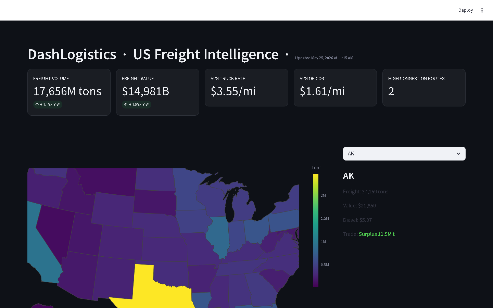

# DashLogistics — US Freight Intelligence

[](https://python.org)
[](https://streamlit.io)
[](https://docker.com)
[](https://www.bts.gov/faf)

> End-to-end logistics intelligence platform. Real public data — BTS FAF freight flows, USDA truck rates, AAA/EIA fuel prices — transformed into interactive maps, cost models, and congestion analytics.

---

## Dashboard Preview



| Tab | Preview | Content |
|-----|---------|---------|
| **Volumes** |  | National freight trends (2018-2024), top commodities, mode split, trade balance map, top 20 lanes |
| **Costs & Congestion** |  | Operating cost breakdown by state, congestion heatmap, route-level costs, most efficient lanes |
| **Routes by Mode** |  | Truck / Rail / Water flow maps with lane tables |
| **Deep Dive** |  | State-level drill-down: metrics, trade balance, outbound/inbound, cost summary, congestion, USDA rates |

---

## Quick Start

### Local

```bash
git clone https://github.com/juandelaf1/DashLogistics.git
cd DashLogistics
pip install -r requirements.txt

# Run the full pipeline
python main.py

# Launch the dashboard
streamlit run dashboard/dashboard.py --server.port 8502
```

### Docker

```bash
# Build & run (pipeline runs automatically during build)
docker compose up -d

# Open http://localhost:8502
```

The pipeline runs at build time to create the SQLite database. Subsequent runs use the persisted Docker volume.

---

## Pipeline

```
┌─────────────────────────────────────────────────────────────────────┐
│                      DashLogistics Pipeline                         │
├─────────────────────────────────────────────────────────────────────┤
│                                                                     │
│  BTS FAF 5.7.1 ──► store_freight_data() ──► freight_by_state       │
│  (86MB, 182K rows)                       ──► freight_lanes          │
│                                           ──► freight_mode_split    │
│                                           ──► freight_commodities   │
│                                           ──► freight_yearly        │
│                                           ──► freight_trade_balance │
│                                           ──► freight_lanes_*mode*  │
│                                                                     │
│  USDA Ag Transport ──► store_usda_rates() ──► truck_rates           │
│  (SODA API, 263 rec.)                                               │
│                                                                     │
│  OSRM Routing ──────► osrm_routing.py ────► state_routes            │
│  (project-osrm.org)                       ──► route_costs           │
│                        + cost_estimator   ──► route_congestion      │
│                                           ──► lane_efficiency       │
│                                                                     │
│  EIA Fuel API ───────► fetch_fuel_prices() ─► eia_fuel_prices       │
│                                                                     │
│  AAA Scraper ────────► scrape_fuel_prices() ─► fuel_prices          │
│                                                                     │
└─────────────────────────────────────────────────────────────────────┘
                              │
                              ▼
                    ┌─────────────────────┐
                    │   Streamlit Dashboard │
                    │   localhost:8502      │
                    └─────────────────────┘
```

### Steps

| # | Step | Source | Output |
|---|------|--------|--------|
| 1 | Download raw data | Census CSV | `data/raw/` |
| 2 | ETL clean & validate | CSV → Pydantic | `shipping_stats` |
| 3 | AAA fuel scraping | AAA Gas Prices | `fuel_prices` |
| 4 | OpenWeather enrichment | OpenWeatherMap | `weather_data` |
| 4b | EIA fuel prices | EIA API | `eia_fuel_prices` |
| 5 | Enriched dataset | Merge + KPIs | `enriched_data.csv` |
| **6** | **FAF freight flows** | BTS FAF 5.7.1 | 10 freight tables |
| **7** | **USDA truck rates** | USDA Ag Transport | `truck_rates` |
| **8** | **Cost & congestion** | OSRM + engine | `route_costs`, `route_congestion`, `lane_efficiency` |

Steps 1-5 are legacy; steps 6-8 power the current dashboard.

---

## Data Sources

| Source | Data | Method |
|--------|------|--------|
| **BTS FAF 5.7.1** | State-to-state freight flows (tons, value, mode, commodity, 2018-2024) | Public CSV (86MB) |
| **USDA Ag Transport** | Refrigerated truck rates per mile by lane | SODA API (free) |
| **OSRM** | Driving distance & time between state centroids | Public routing API |
| **AAA Gas Prices** | Regular & diesel prices by state | Web scraping |
| **EIA** | Official weekly fuel prices by state | REST API (free key) |

---

## Project Structure

```
├── main.py                       # Pipeline orchestrator (8 steps)
├── Dockerfile                    # Multi-stage Docker build
├── docker-compose.yml            # Container orchestration
├── requirements.txt              # Python dependencies
│
├── src/
│   ├── etl/
│   │   ├── enrichment/
│   │   │   ├── faf_loader.py     # FAF 5.7.1 → SQL tables
│   │   │   ├── usda_rates.py     # USDA API client
│   │   │   ├── osrm_routing.py   # OSRM distance/time with caching
│   │   │   ├── eia_api.py        # EIA fuel price fetcher
│   │   │   └── weather_api.py    # OpenWeatherMap enrichment
│   │   ├── scrapers/
│   │   │   └── fuel_scraper.py   # AAA gas price scraper
│   │   └── etl.py                # Legacy ETL pipeline
│   ├── analysis/
│   │   ├── cost_estimator.py     # Operating cost + congestion proxy
│   │   ├── kpis.py               # 15 derived KPIs
│   │   └── features.py           # Feature engineering
│   ├── database/
│   │   └── database.py           # SQLite/PostgreSQL engine + helpers
│   └── utils/
│       ├── state_mapper.py       # FIPS/state name/code mapping
│       └── download_data.py      # Remote file downloader
│
├── dashboard/
│   └── dashboard.py              # Streamlit app (4 tabs)
│
└── data/
    ├── raw/                      # Raw datasets (FAF zip, etc.)
    ├── clean/                    # Cleaned intermediate files
    ├── final/                    # Enriched CSV outputs
    └── dashlogistics.db          # Main SQLite database
```

---

## Feature Engineering

All derived from public data — no paid APIs.

| Feature | Formula | Source |
|---------|---------|--------|
| **Operating Cost** | fuel + driver + maintenance per mile | EIA diesel × 6.5mpg + $35/hr + $0.15/mi |
| **Congestion Ratio** | actual hours / free-flow hours (55mph) | OSRM actual vs ideal time |
| **Lane Efficiency** | tons per dollar | FAF volume / operating cost |
| **Trade Balance** | outbound - inbound tons | FAF state-level flows |
| **Fuel Cost %** | fuel / total operating cost | Derived |

---

## Environment Variables

| Variable | Required | Default | Purpose |
|----------|----------|---------|---------|
| `DATABASE_URL` | No | SQLite fallback | PostgreSQL connection |
| `EIA_API_KEY` | No | — | Official fuel prices |
| `OPENWEATHER_API_KEY` | No | — | Weather enrichment |

No API keys are required for basic functionality. FAF, USDA, and OSRM data are all public/free.

---

## License

MIT

---

<p align="center">Data-driven logistics intelligence — built with public data.</p>
